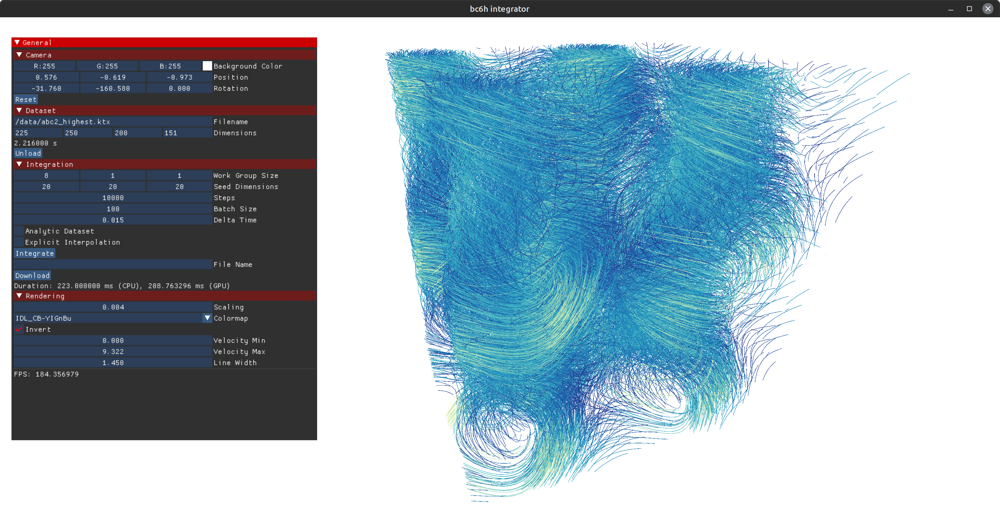

# BC6H Integrator
This repository contains the source for the BC6H integration method as published in the paper [Leveraging BC6H Texture Compression and Filtering for Efficient Vector Field Visualization]().



## Building
Building the application requires an C++20 compiler and CMake version >= 3.12.
Simply clone the repository and run CMake as usual.
The following command can clones and builds the application and all of its dependencies:
```sh
git clone https://github.com/VRGroupRWTH/bc6h-integrator.git && \
cd bc6h-integrator && \
mkdir build && \
cd build && \
cmake -DCMAKE_BUILD_TYPE=Release .. && \
cmake --build . -j
```
When launching the built application `bc6h-integrator` will whow an empty viewport with a simple UI.

## Dataset Loading
Datasets can either be loaded using the `Load` button under the Dataset header or by specifying the filename as a command line parameter.
The application supports [`KTX`](https://registry.khronos.org/KTX/specs/1.0/ktxspec.v1.html) and `RAW` files.
The RAW format is a binary format that stores four 32 bit unsigned integers in the beginning of the file specifying the dimensions of the dataset followed by either 32 bit floats, 16 bit floats or BC6H compressed blocks.
Please note, that for floating point data the values are stored component-wise, e.g., first all x values are stored, followed by the y and z values.
These files can be generated by our [Texpress tool](https://github.com/VRGroupRWTH/Texpress).
After loading a dataset, its properties can be viewed under the Dataset header, specifying its filename and dimensions.

## Integration
The parameters for the integration can be specified under the `Integration` header in the UI.

* *Work Group Size* specifies the work group size of the compute shader, i.e., how many path lines are computed in parallel. This does not influence the outcome but impacts the runtime of the integration.
* *Seed Dimensions* specifies how many seeds are spawned within the dataset. The Seeds are spawned uniformly.
* *Steps* specifies how many integration steps will be performed for each path line.
* *Batch Size* specifies how many integration steps are performed within a single compute shader invokation. I.e., if this value is smaller than the number of steps, the workload is split into multiple compute shader invokations. This can help to avoid driver crashes when a computer shader takes too long.
* *Delta Time* specifies the fixed timestep for the integration. This parameter is automatically adjusted when changing the number of steps to span the whole time dimensions.
* *Analytic Dataset* specifies whether to use the analytic form of the ABC dataset instead of the loaded one. This will, however, use the dimensions of the loaded dataset.
* *Explicit Interpolation* specifies if the integration uses implicit or explicit interpolation.

After specifying these parameters, pressing the `Integrate` button will start the integration process and the pathlines will appear in the viewport.
The resulting pathlines can be saved to file via specifying a `File Name` and pressing the download `Download` button.
This will generate two files: `{filename}_length.bin` and `{filename}_trajectory.bin`.
`{filename}_length.bin` contains the length of each pathline as an unsigned 32 bit integer.
`{filename}_trajectory.bin` contains the all points for all pathlines.
Each point is represented by four 32 bit floating point values where the first three specify the position in 3d space and the fourth one its current velocity.

All these parameters can also be specified via the command line, in addition to some other flags mainly used for benchmarking.
Look at [`command_parser.cpp`](src/command_parser.cpp) for more information.

## Controls
The camera is controlled via mouse and keyboard.
* *WASD-Keys*: move forward and backwards and strafe left and right.
* *Left Mouse Button*: hold to rotate camera.
* *Right Mouse Button*: hold to pan the camera.
* *Mouse Wheel*: zoom in and out.

The current position and rotation of the camera is shown at the top of the UI under the `Camera` header.
Pressing the `Reset` button will move the camera back to its starting position.

## Rendering
There are a few parameters that influence how the pathlines are rendered which can be found under the `Rendering` header in the UI.
* *Scaling* can be used to 
* *Color Map* the color map used for rendering the path lines. The color is influenced by the velocity of the particle at that position.
* *Color* the color of the lines, if the colormap is set to `Constant Color`.
* *Invert* specifies whether the colormap should be inverted.
* *Velocity Min* the velocity that corresponds to the lower end of the colormap.
* *Velocity Max* the velocity that corresponds to the upper end of the colormap.
* *Line Width* specifies the thickness of the lines.
